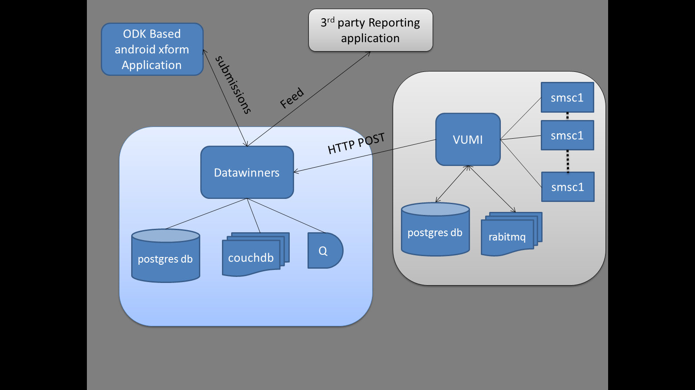

##Overview

### Application Components

* Django admin interface -- organization and settings management
* Vumi - messaging api supports multiple smpp providers and http api for sms
* Questionnaire management
* Submission edit and search
* Reminders
* Smartphone support and ODK based application
* Submission Feeds
* Import / Export
